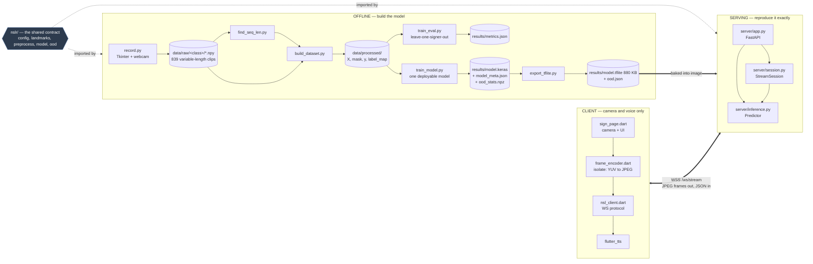
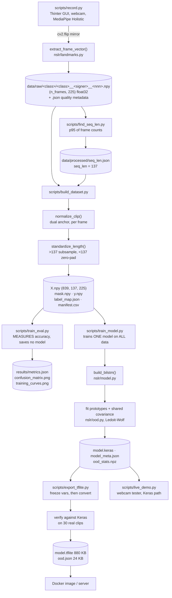
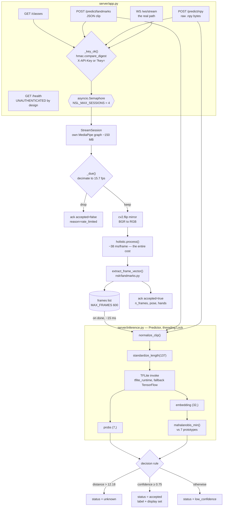
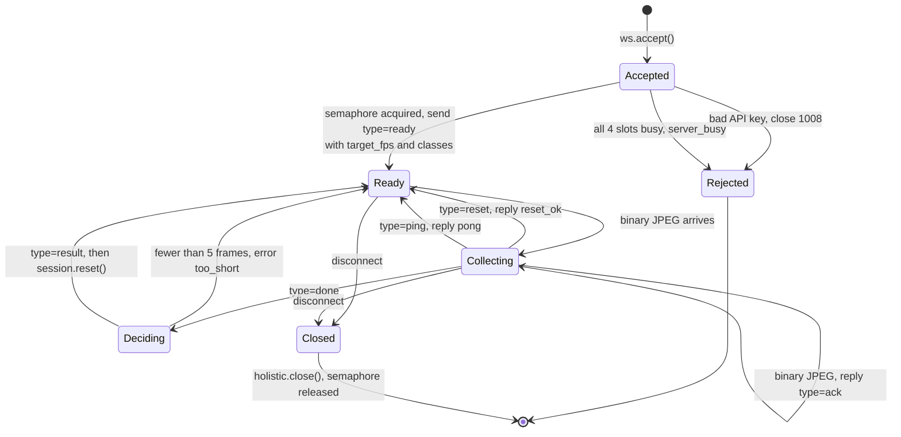
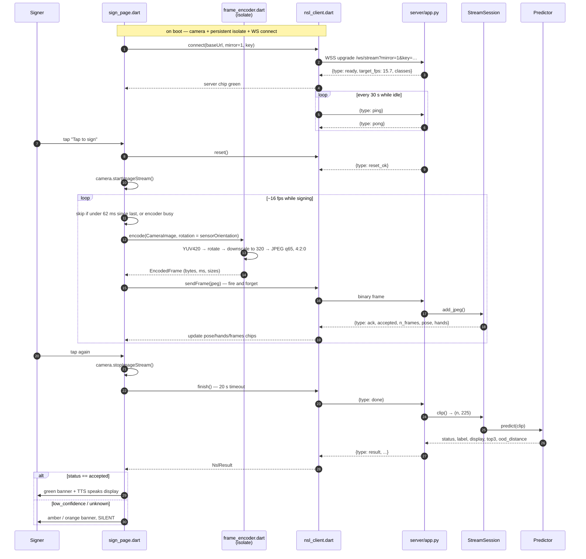
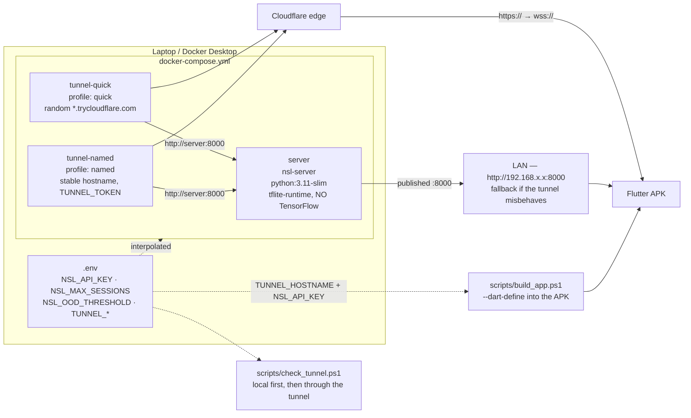

# NSL Recognition — System Architecture Report

How this codebase turns a person signing in front of a camera into a spoken
Nepali Sign Language emergency phrase, and how every part is wired to every
other part.

Generated 2026-08-07 from a full read of the repository at `master` (`bf2152f`
plus three uncommitted working-copy edits — see [Working-copy
drift](#8-working-copy-drift)).

---

## 1. What the system is, in one paragraph

A signer performs one of seven gestures. Their body is reduced, frame by frame,
to a **225-number pose/hand landmark vector** by MediaPipe Holistic. A clip of
those vectors is normalized against anatomical anchors (shoulders for the body,
wrist-to-knuckle for each hand), squeezed or padded to a fixed **137 frames**,
and fed to a small **bidirectional LSTM** that emits a 7-way softmax plus a
32-dimensional embedding. The softmax names the phrase; the embedding is scored
against per-class prototypes by **Mahalanobis distance** so the system can also
say "that wasn't any sign I know". Training happens offline on a laptop; serving
happens in a **FastAPI container**; the phone is a **Flutter client** that is
only a camera, a WebSocket, and a text-to-speech voice.

There are three planes, and the whole design hinges on making the second and
third reproduce the first *exactly*.



The dotted lines are the important ones. `nslr/` is imported by both the
training scripts and the server, so the request path at inference is *the same
Python code* the accuracy was measured on — not a reimplementation of it.

---

## 2. The contract: five constants that everything obeys

Every component in this repo is coupled to the same five facts. They live in
[nslr/config.py](nslr/config.py) and nowhere else. Break one and the model
silently degrades rather than erroring — which is why they are documented as
constraints, not tuning knobs.

| # | Constant | Value | Who depends on it |
|---|---|---|---|
| 1 | **Feature layout** | `[pose 99 \| left hand 63 \| right hand 63]` = 225 | `landmarks.py`, `tasks_landmarks.py`, `preprocess.py`, `session.py`, `inference.py`, the model's input shape |
| 2 | **Normalization anchors** | pose: mid-shoulder / shoulder-width · hand: wrist / wrist-to-MCP-9 | `preprocess.py`, used identically at train and inference time |
| 3 | **Sequence length** | `seq_len = 137` (p95 of recorded frame counts) | `build_dataset.py`, model input, `model_meta.json`, `inference.py` |
| 4 | **Capture rate** | `TRAIN_CAPTURE_FPS = 15.7` (measured, never set) | `session.py` decimator, the Flutter client's 16 fps cap, `/health` |
| 5 | **Mirroring** | every frame flipped horizontally before detection | `record.py`, `live_demo.py`, `session.py`; client sends **un**mirrored |

### The 225-vector

```
index:  0 ........................ 98 | 99 ............ 161 | 162 ........... 224
block:  POSE (33 landmarks x, y, z)   | LEFT HAND (21x3)    | RIGHT HAND (21x3)
slice:  C.POSE_SLICE                  | C.LEFT_HAND_SLICE   | C.RIGHT_HAND_SLICE
```

Any block MediaPipe fails to detect is **zero-filled**. This is load-bearing:
the normalization formulas map zero to zero (`(0 - 0) / (0 + eps) = 0`), so
undetected blocks and zero-padded frames both stay exactly zero, and the Keras
`Masking(mask_value=0.0)` layer skips them for free. That is why
[nslr/preprocess.py](nslr/preprocess.py) normalizes *before* padding, and why
`mask.npy` is generated but never actually passed to `fit()`.

### Why frame rate is a correctness issue, not a performance one

The model has no explicit time axis — it reads **frame count as duration**. A
sign captured at 30 fps produces twice the frames of the same sign at 15.7 fps,
which is a temporal scale the model has never seen. So:

- `record.py` never locked an fps; it ran as fast as Tkinter + MediaPipe allowed,
  and the resulting **15.7 fps median (10.8–21.2 range)** is an *observed
  property of the data*.
- [server/session.py](server/session.py) therefore decimates incoming frames to
  15.7 fps **before** MediaPipe, using a due-time accumulator rather than a naive
  `t - last >= period` test (which aliases a 16 fps client down to 8 fps).
- The Flutter client caps at **16 fps**, deliberately just above the target so
  jitter never starves it.

---

## 3. Offline pipeline — how the model gets built



### Component notes

**[scripts/record.py](scripts/record.py)** — the data collection tool. Saves
**raw, un-normalized, variable-length** clips on purpose, so `seq_len` and the
normalization scheme stay cheap re-runnable knobs. Each clip gets a sidecar
`.json` with per-block detection rates; `build_dataset.py --min-hand-detect`
can later drop weak clips using them. Filenames encode the signer
(`<class>__<signer>__<idx>.npy`), which is the *only* thing that makes
leave-one-signer-out evaluation possible downstream.

> **It saves landmarks only — never video.** This is the single most consequential
> decision in the repo. Any change to the landmark source (e.g. moving to
> MediaPipe Tasks for on-device) cannot be re-derived from the existing data; it
> would mean re-recording all 839 clips.

**[nslr/dataset.py](nslr/dataset.py)** — `compile_dataset()` skips empty class
folders (so a not-yet-recorded `none` class never creates a zero-sample label),
records a `manifest.csv` mapping every row of `X` back to its source file and
signer, and writes `dropped.csv` when clips are filtered.
`eligible_test_signers()` encodes a subtle rule: a signer can only be held out
if removing them still leaves **every class** present in the remainder,
otherwise the model would be scored on a class it never saw.

**[nslr/model.py](nslr/model.py)** — the whole architecture, 18 lines:

```
Input(137, 225) → Masking(0.0) → BiLSTM(64, seq) → Dropout(0.3)
                → BiLSTM(32)   → Dropout(0.3)
                → Dense(32, relu)          ← the OOD embedding space
                → Dense(7, softmax)
```

The `Dense(32)` layer does double duty: it is the penultimate feature layer that
the open-set gate measures distance in. That is why `export_tflite.py` exports
**two** outputs.

**[nslr/ood.py](nslr/ood.py)** — open-set rejection. A 7-way softmax is
closed-world: it will confidently name a phrase for *anything*, including random
waving. So `train_model.py` fits one prototype (mean embedding) per class plus a
shared within-class covariance with **Ledoit-Wolf shrinkage** (stable at this
sample size), and inference measures the Mahalanobis distance to the nearest
prototype. Beyond the threshold → `unknown`. The threshold is the **p99 of
training distances**, currently `12.183`.

`train_model.py` also validates the gate against *synthetic* OOD it fabricates
from real clips — half time-shuffled (motion order destroyed), half cross-class
splices (first half of one sign + second half of another) — and reports AUROC.

**[scripts/export_tflite.py](scripts/export_tflite.py)** — deals with a real
toolchain failure: on this pinned TF 2.17 / Keras 3 stack, both
`from_keras_model()` and `from_saved_model()` abort the *process* inside MLIR
(`LLVM ERROR: Failed to infer result type(s)`) — not a catchable exception.
Freezing variables to constants first sidesteps it. The export is then verified
against Keras on 30 real clips and **refuses to ship** if they disagree
(currently: worst |Δp| = 1.19e-7, argmax agreement 100%). It also re-emits the
OOD stats as framework-independent `ood.json`, which is what the container
actually loads.

---

## 4. Serving — the request path



### The decision rule

Order matters: **the OOD gate wins over confidence.** A clip can be 99% "call
police" by softmax and still come back `unknown` if its embedding sits far from
every prototype.

| status | Meaning | `label` / `display` | Client behaviour |
|---|---|---|---|
| `accepted` | passed both gates | set | shown green **and spoken** |
| `low_confidence` | softmax < 0.75, distance OK | `null` | shown amber, silent |
| `unknown` | Mahalanobis distance > 12.18 | `null` | shown orange, silent |

`best_guess` and `top3` are always populated regardless of status, which is what
makes the telemetry useful when something goes wrong.

### Why streaming, not uploading

Landmark extraction is ~38 ms/frame and is essentially the *entire* pipeline
cost. A 95-frame clip is ~3.6 s of MediaPipe work. Streaming frames *while the
user signs* overlaps that work with the signing itself, so when the client says
`done` only normalize + standardize + infer remain — about **15 ms**. Uploading
a finished video would serialize the two and add several seconds of dead air in
front of an audience.

### Concurrency model

- One `StreamSession` per WebSocket, each holding its **own MediaPipe Holistic
  graph (~150 MB)** — so concurrency is *memory*-bound, not CPU-bound.
  `NSL_MAX_SESSIONS` sheds load with a clean `server_busy` error instead of an
  OOM kill.
- All blocking work (`StreamSession.__init__`, `add_jpeg`, `_predict`, `close`)
  goes through `run_in_threadpool`, keeping the event loop responsive.
- A module-level `threading.Lock` serializes `predict()` because **TFLite
  interpreters are not thread-safe**.
- Uvicorn runs `--workers 1` on purpose. Scale with container replicas, not
  in-process workers.

### The WebSocket session lifecycle



### Authentication

`NSL_API_KEY` unset leaves the API open — fine on a LAN, **not** fine behind a
tunnel. When set, every endpoint except `/health` requires it, compared with
`hmac.compare_digest` to avoid leaking length or prefix through timing.
`/health` stays open so the Docker healthcheck and the phone's "can I even reach
this" test keep working. The key is accepted as an `X-API-Key` header **or** a
`?key=` query param — the query form exists because WebSocket clients cannot
reliably set headers on the upgrade request, and the Flutter app relies on that.

---

## 5. The Flutter client

The phone recognizes nothing. It is a camera, a socket, and a speaker.



### [frame_encoder.dart](app/lib/frame_encoder.dart) — the client bottleneck

Pure-Dart JPEG encoding is the slowest thing on the phone, so this file is
essentially one long optimization:

- Rotation and downscaling are **folded into the colour-conversion loop** — one
  pass over *output* pixels, no intermediate full-size buffers. (The naive
  version was convert → `copyRotate` → resize: three allocations, two at full
  resolution.)
- Nearest-neighbour sampling, so a 720p source costs the same as 480p once
  downscaling. Only `maxWidth` (default **320**) drives cost.
- Integer fixed-point BT.601 YUV maths, matching server-side `cv2.cvtColor` to
  within a rounding step.
- JPEG chroma forced to **4:2:0** (the package default is 4:4:4) — landmarks come
  from luma structure, not chroma resolution.
- A **persistent** isolate, not `compute()`, which would spawn a fresh one per
  call at 16 fps.
- **Backpressure by dropping**, not queueing: `encode()` returns `null` while a
  frame is in flight. Correct, because the server decimates anyway and a queue
  would only add latency.

### Rotation, and why `pose` goes red

Android delivers camera frames in **sensor orientation**. The app is
portrait-locked (`main.dart` sets `portraitUp` because letting the device rotate
mid-sign would change the frame geometry underneath the recognizer), so frames
must be rotated by `sensorOrientation` or MediaPipe sees a person lying on their
side and detects **no pose at all**. This is the documented first-suspect for a
red `pose` chip.

### Mirroring — the one that silently swaps your hands

```
record.py:      cv2.flip(frame, 1)  →  landmarks are of a MIRRORED image
session.py:     cv2.flip(bgr, 1)    →  same flip, reproduced server-side
client:         sends frames UNMIRRORED, mirror=1 in the query string
preview only:   Transform.scale(scaleX: -1) — display, never the wire
```

The client keeps `mirror=1` for **both** lenses. That is not an oversight: the
lens faces the signer either way, so a raw frame has the signer's right hand on
the image-left in both cases. Making the flag depend on the lens would swap the
left/right hand blocks in the 225-vector for one of them.

### Telemetry chips

They come from the *server's* per-frame acks, so they report what the server
sees, not what the phone thinks it sent — which is exactly what you want when
debugging live.

| Chip | Source | Green/red means |
|---|---|---|
| `server` | socket state | connected; tap when red to reconnect |
| `pose` | `ack.pose` | server detects a body — red usually means rotation |
| `hands` | `ack.hands` | server detects ≥1 hand |
| `frames` | `ack.n_frames` | frames **kept** after decimation |
| `fps` | client-side | what the phone actually sends; **under ~10 hurts accuracy** |
| `enc` | `EncodedFrame.millis` | per-frame encode cost against a 62 ms budget |

### Robustness details worth knowing

- **30 s keepalive ping.** Cloudflare closes idle WebSockets, and between signs
  this one is idle. Without the ping, the first sign works and a later one fails
  with a disconnect minutes later — an intermittent failure that is miserable to
  diagnose in front of an audience.
- **`_busy` re-entrancy guard.** The button is a toggle and both handlers await
  before the guarding state is visible; without it a double-tap causes two
  `reset()` calls (the second orphans the first's completer, which then hangs its
  full timeout) and two `startImageStream()` calls (the second throws).
- **`finish()` supersedes a live completer** rather than dropping it, so nobody
  waits out a 20 s timeout for a reply now addressed elsewhere.
- **`sendFrame` swallows errors** — a socket dying mid-clip would otherwise throw
  16 times a second from a callback with nowhere to report.
- **Timeout → reconnect.** A wedged-but-open socket is rebuilt rather than left
  to fail the next sign the same way.

---

## 6. Deployment



**The image deliberately has no TensorFlow.** It runs the 880 KB TFLite export
via `tflite-runtime`, which is the difference between a ~1 GB image and a ~3 GB
one. `inference.py` falls back to TensorFlow's interpreter automatically when
`tflite_runtime` is absent (which is what happens in the Windows `.venv`, since
`tflite-runtime` ships no Windows wheels).

**Compose interpolation trap**, documented in the file: `${TUNNEL_TOKEN:-}` is
plain on purpose. Compose interpolates the entire file *before* applying
profiles, so a `${TUNNEL_TOKEN:?...}` guard would break `docker compose up -d`
for anyone who never set up a named tunnel.

**Zero-setup APKs.** `build_app.ps1` reads `TUNNEL_HOSTNAME` and `NSL_API_KEY`
from `.env` and passes them as `--dart-define`, so a fresh install opens straight
to the camera. A URL saved from the gear icon **wins** over the compiled-in one
(a deliberate override); `-Install` uninstalls first, clearing SharedPreferences,
which is what makes a fresh install pick up the baked value.

**Android cleartext.** `network_security_config.xml` permits cleartext HTTP so a
plain `http://192.168.x.x:8000` LAN demo works on Android 9+. Irrelevant on the
tunnel path, which is `https`/`wss` end to end.

---

## 7. Current state — the actual numbers

### Dataset (`data/`, a separately-cloned repo — see finding 5)

| | |
|---|---|
| Clips | **839** across 7 classes and 8 signers |
| Per class | `building_on_fire` 120 · `call_police` 120 · `cant_breathe` 123 · `help_danger` 121 · `need_ambulance` 120 · `need_toilet` 125 · `none` 110 |
| Per signer | s01 140 · s02 150 · s03 140 · s04 149 · s05 60 · s06 60 · s07 70 · s08 70 |
| Frame counts | min 18 · median 89 · mean 90.2 · max 217 → **seq_len 137** at p95 |
| Capture rate | 15.7 fps median (10.8–21.2 range), measured not set |

### Model (`results/model_meta.json`)

| | |
|---|---|
| Classes | 7 (six phrases + `none` negatives) |
| Input | `(137, 225)` |
| Embedding | Dense-32 |
| Confidence threshold | 0.75 |
| OOD threshold | **12.183** (p99 of training distances) |
| Keras | 2.37 MB · **TFLite 880 KB** |
| Export verification | worst \|Δp\| 1.19e-7, argmax agreement 100% over 30 clips |

### Accuracy (`results/metrics.json`, all 8 signers eligible for holdout)

| Protocol | Accuracy |
|---|---|
| Signer-independent, mean over 8 folds | **97.83% ± 1.42%** |
| Signer-independent, pooled (839 predictions) | **97.38%** |
| Random-split baseline (stratified) | 99.21% |

Per-fold: s01 .971 · s02 .967 · s03 .971 · s04 .960 · s05 1.000 · s06 1.000 ·
s07 .986 · s08 .971.

Per-class F1 is ≥0.975 for all six **phrases**. The weak class is `none`
(precision .951, recall **.882**) — unsurprising, since "not a sign" is an
open-ended category and 13 of its 110 clips leak into real phrases. Those 13
are the most consequential errors in the matrix: they are the cases where the
system would speak an emergency phrase for a non-sign, and they are exactly what
the Mahalanobis gate is there to catch as a second line of defence.

### Open-set threshold trade (documented in `.env.example`)

| Threshold | Real signs wrongly rejected | Nonsense caught |
|---|---|---|
| **12.18** (fitted) | 1.1% | 42% |
| 16.00 | 0.1% | 22% |
| 17.00 | 0.1% | 18% |

`NSL_OOD_THRESHOLD` overrides it without a retrain; `off` disables the gate
entirely, which returns the system to a closed-world softmax that will name a
phrase for anything.

---

## 8. Findings

Ordered by how much they'd cost you.

### 8.1 The `none` class can be spoken aloud

`none` is a real trained class with a real display label. If the model predicts
it with ≥0.75 confidence and the embedding is *close* to the `none` prototype
(which is exactly what should happen for a genuine non-sign), then
[server/inference.py:128](server/inference.py#L128) sets `status = "accepted"`,
`label = "none"`, `display = "7. Unknown / none of the above (negatives)"` — and
[app/lib/sign_page.dart:316](app/lib/sign_page.dart#L316) speaks
`result.display` on any accepted result.

So a correctly-recognized non-sign makes the phone say **"seven. Unknown /
none of the above (negatives)"** out loud.

Every other layer treats "not a sign" carefully — the OOD gate, the
speak-only-on-accepted rule, the docs in three files — but the `none` class was
added to the label set without being special-cased in the response contract. The
fix is small (map `none` to a `unknown`/`rejected` status in `Predictor.predict`,
or give it a spoken-safe display string), but the current wiring is a live demo
hazard.

### 8.2 Documentation quotes a different model than the one committed

The top-level [README.md](README.md) describes **6 classes, 4 signers, seq_len
151, 99.7%**. The committed artifacts are **7 classes, 8 signers, seq_len 137,
97.83% mean / 97.38% pooled**. The README's "Current results" table
(99.74 / 99.73 / 98.59) matches no file in the repo.

The `99.7%` figure has propagated: [server/README.md](server/README.md) states
it twice as the justification for the server-side architecture, and it appeared
in `server/inference.py`'s docstring (deleted in the working copy, see 8.8).
The real number is still strong and the *argument* is unaffected — but the
report and the slides should quote 97.8%, and README's layout section still
lists a 6-class table and `data/` as if it were a plain local folder.

### 8.3 `server/README.md` quotes a stale OOD threshold

It says `accepted` means "distance ≤ **13.02**". The committed threshold is
**12.183** (`model_meta.json`, `ood.json`, and the `.env.example` trade table all
agree on 12.18). Only `server/README.md` is out of step.

### 8.4 The on-device question is still open, and unmeasurable without new data

The parity experiment is fully wired — [nslr/tasks_landmarks.py](nslr/tasks_landmarks.py)
reimplements the 225-vector from PoseLandmarker + HandLandmarker (including a
nearest-pose-wrist rule to reproduce Holistic's implicit hand assignment),
`parity_spike.py` records paired clips, `parity_report.py` renders a
GO / MARGINAL / NO-GO verdict, and the two `.task` bundles are downloaded in
`models/tasks/`. But **`data/parity/` is empty** — no pairs have been recorded,
so no verdict exists.

This matters more than it looks: `parity_report.py` needs ≥20 clips (≥5 per
phrase) before it reports anything but INCONCLUSIVE, and it is the *only*
evidence that could justify moving inference on-device. Until it runs, "requires
a network" is a permanent property of the system, not a temporary one. Roughly
35 recorded clips is the whole cost.

### 8.5 `data/` is a nested clone, not a submodule

`data/` contains its own `.git` pointing at
`github.com/Minor-Project-Semantic-Memex/dataset.git`, but there is **no
`.gitmodules`** and the parent repo does not track the path at all. So the parent
has no pin on which dataset revision produced the committed model. Two clones of
this repo can build measurably different models from the same commit, and
`results/metrics.json` cannot be traced back to a dataset revision. Registering
it as a real submodule would cost one command and close that gap.

### 8.6 Duration is only encoded up to `seq_len`

`standardize_length()` pads clips shorter than 137 frames (so frame count
survives) but **uniformly subsamples** longer ones (so it does not). With a
median of 89 frames and a max of 217, most clips keep their duration signal and
a minority get temporally compressed to look like exactly-137-frame clips. This
is a reasonable engineering choice, but it means "the model reads frame count as
duration" — the premise behind the entire fps-decimation design — holds only
below 137 frames. Anything longer than ~8.7 s of signing is scale-normalized
instead.

### 8.7 A fully-undetected frame is indistinguishable from padding

`Masking(mask_value=0.0)` skips any timestep that is all zeros. A real frame
where MediaPipe found neither pose nor hands is all zeros, so it is silently
dropped from the sequence — which is arguably the right behaviour, but it means
the model cannot distinguish "the signer paused out of frame" from "the clip
ended here". Combined with 8.6, a clip with many undetected frames is
effectively shorter than its frame count suggests.

### 8.8 Working-copy drift: three uncommitted edits, two of them deletions

| File | Change |
|---|---|
| `scripts/build_app.ps1` | **+** `-SplitPerAbi` switch and an APK size listing at the end. Genuine improvement, worth committing. |
| `server/Dockerfile` | **−** all explanatory comments, including the "build from the REPO ROOT, not from server/" instruction and the note that `results/*.tflite` is gitignored so the build fails loudly if `export_tflite.py` was skipped. |
| `server/inference.py` | **−** the entire module docstring, including the statement that reusing `nslr.preprocess` rather than reimplementing it is the whole point of serving from Python. |

The two deletions strip the *rationale* from exactly the two files where a
future contributor is most likely to "simplify" something load-bearing. The
build-from-repo-root instruction in particular now exists only in `DEMO.md`.

### 8.9 Smaller things

- **`requests` and `websockets` are not in any requirements file**, but
  `scripts/test_client.py` needs both. The script degrades gracefully for
  `websockets` (skips with a note) but hard-fails on `requests`.
- **`maxWidth` doc drift.** `frame_encoder.dart` defaults to 320 and
  `sign_page.dart` never overrides it, but `app/README.md` and `DEMO.md` both
  advise *lowering* it "to 480" when fps is poor — which would raise it.
- **No automated tests.** Verification is entirely by executable scripts:
  `export_tflite.py --verify` (export fidelity), `test_client.py` (server path
  reproduces the offline pipeline), `parity_report.py` (landmark source
  equivalence). They are good checks, but nothing runs them automatically and
  nothing covers `nslr/preprocess.py` directly.
- **`find_seq_len.py` doesn't set a matplotlib backend** the way `train_eval.py`
  does (`matplotlib.use("Agg")`), so it can block on a headless machine unless
  `--show` is deliberately omitted from an interactive context.
- **App untested on physical hardware**, per `app/README.md`. It compiles and
  analyzes clean and the server side is verified end to end, but rotation and
  sustained fps are the two things that can only be found on a real phone.
- **`.claude/settings.json` carries a stale allowlist entry** — a hardcoded
  `taskkill //PID 22320 //F` permission for a PID that no longer exists.

---

## 9. Quick reference

### Where the logic actually lives

| Concern | Single source of truth |
|---|---|
| Constants, class list, paths | [nslr/config.py](nslr/config.py) |
| MediaPipe result → 225-vector | [nslr/landmarks.py](nslr/landmarks.py) |
| Normalization + length standardization | [nslr/preprocess.py](nslr/preprocess.py) |
| Model architecture | [nslr/model.py](nslr/model.py) |
| Open-set rejection maths | [nslr/ood.py](nslr/ood.py) |
| Decision rule (status/label/top3) | [server/inference.py](server/inference.py) |
| Frame decimation + mirroring | [server/session.py](server/session.py) |
| WS protocol (server side) | [server/app.py](server/app.py) |
| WS protocol (client side) | [app/lib/nsl_client.dart](app/lib/nsl_client.dart) |

### Environment variables

| Variable | Default | Effect |
|---|---|---|
| `NSL_API_KEY` | *(empty)* | Requires the key on everything but `/health`. Set it whenever a tunnel runs. |
| `NSL_MAX_SESSIONS` | `4` | Concurrent WS sessions; a memory budget (~150 MB each). |
| `NSL_OOD_THRESHOLD` | *(empty → fitted 12.18)* | Overrides the reject distance; `off` disables the gate. |
| `TUNNEL_TOKEN` | — | Named-tunnel profile only. |
| `TUNNEL_HOSTNAME` | — | Not used by cloudflared; consumed by `build_app.ps1` and `check_tunnel.ps1`. |

### Endpoints

| Method | Path | Auth | Purpose |
|---|---|---|---|
| GET | `/health` | **no** | Backend, classes, thresholds, target fps, `auth_required` |
| GET | `/classes` | yes | Class keys + display labels |
| POST | `/predict/landmarks` | yes | `{"clip": [[225 floats] × n]}` — verification path |
| POST | `/predict/npy` | yes | Raw `.npy` bytes, ~10× less wire overhead |
| WS | `/ws/stream` | yes | The real path: live JPEG frames → decision |

### End-to-end rebuild

```bash
python scripts/record.py            # 1. record clips (GUI)
python scripts/find_seq_len.py      # 2. derive seq_len → data/processed/seq_len.json
python scripts/build_dataset.py     # 3. X / mask / y / manifest
python -u scripts/train_eval.py     # 4. measure (metrics.json, no model saved)
python scripts/train_model.py       # 5. train the deployable model + OOD stats
python scripts/export_tflite.py     # 6. model.tflite + ood.json, verified
docker compose up -d                # 7. serve  (--profile named for a tunnel)
python scripts/test_client.py       # 8. verify the server path without a phone
powershell -File scripts/build_app.ps1 -Install   # 9. APK with URL + key baked in
```
